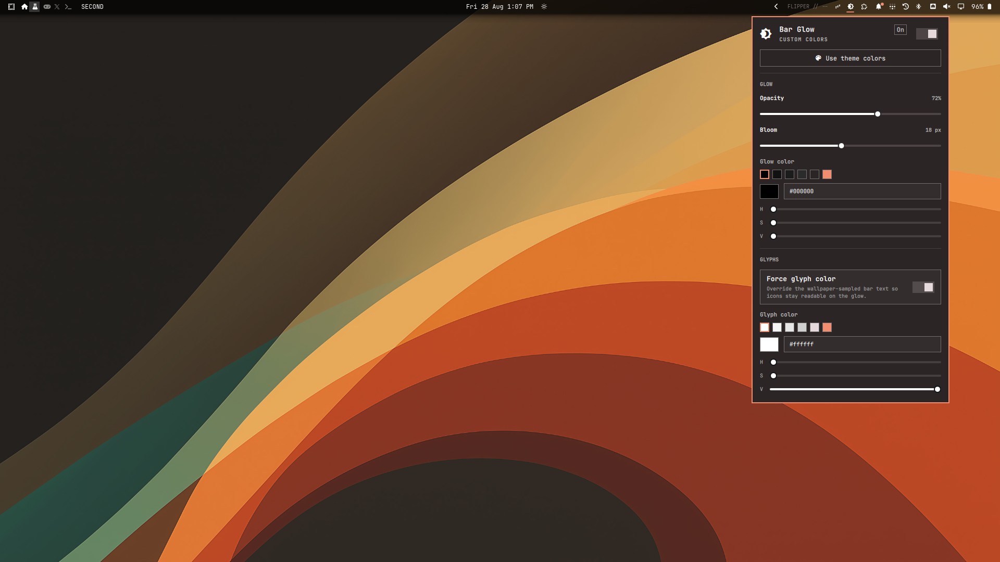

# Bar Glow

Full-width glow behind the **stock** Omarchy 4 (Quattro) bar, so icons and
labels stay readable on any wallpaper. A settings panel on the bar tunes
opacity, bloom, glow color, and glyph color.

It does **not** replace `omarchy.bar`. Third-party full-bar clones currently
fail to load because `Bar.qml` required properties are not injected at
construction
([#6915](https://github.com/basecamp/omarchy/issues/6915),
[#8007](https://github.com/basecamp/omarchy/issues/8007),
[#8202](https://github.com/basecamp/omarchy/issues/8202)).



## Install

```bash
omarchy plugin add https://github.com/07dcolem/bar-glow.git --enable
```

Omarchy will ask which bar section to use (default: **right**). That is the
chip that opens the panel.

If the folder is already at `~/.config/omarchy/plugins/bar-glow/`:

```bash
omarchy plugin validate ~/.config/omarchy/plugins/bar-glow
omarchy-shell shell rescanPlugins
omarchy plugin enable bar-glow --section right
omarchy restart shell
```

Confirm:

```bash
hyprctl layers | grep -E 'omarchy-bar$|omarchy-bar-glow'
omarchy-shell bar-glow status
omarchy-shell bar-glow toggle
```

With a top bar you should see a **bottom-layer** wash covering the whole bar
strip, plus a short bloom on the inner edge:

```
Layer level 1 (bottom):
  ... xywh: 0 0 1920 44, namespace: omarchy-bar-glow
Layer level 2 (top):
  ... xywh: 0 0 1920 26, namespace: omarchy-bar
```

The glow uses `ExclusionMode.Ignore` (exclusive zone `-1`) so it does not
steal reserved space. It sits on `WlrLayer.Bottom`, so it shows through the
transparent bar and never covers widgets or popouts.

## Remove

```bash
omarchy plugin remove bar-glow
```

That deletes `~/.config/omarchy/plugins/bar-glow/` and removes the
plugin from `shell.json`. Glyph color returns to the theme. Nothing is
written under `$OMARCHY_PATH` or `~/.local/share/omarchy`.

## Settings panel

Left-click the bar chip (󰃝). The panel is a stock Omarchy `KeyboardPanel`:

| Control | What it does |
|---|---|
| On/off switch | Show or hide the glow |
| **Use theme colors** | Glow = theme background, glyphs = theme foreground, and both follow `omarchy theme set` |
| Opacity | Peak alpha of the wash (20–100%) |
| Bloom | Soft falloff past the inner edge (0–40 px) |
| Glow color | HSV + hex + presets. Picking a color turns off theme-follow |
| Force glyph color | Override the wallpaper-sampled bar text |
| Glyph color | Forced icon/label color (disabled when Force is off) |

Changes apply live and persist to `~/.config/omarchy/shell.json`. Esc closes
the panel.

## `shell.json` keys

Settings live on the bar-widget entry (and are mirrored onto `plugins[]` if
that entry exists):

```json
{
  "id": "bar-glow",
  "enabled": true,
  "size": 18,
  "opacity": 0.72,
  "color": "#000000",
  "forceWhite": true,
  "contentColor": "#ffffff",
  "followTheme": false
}
```

| Key | Type | Default | Meaning |
|---|---|---|---|
| `enabled` | boolean | `true` | Draw the glow |
| `size` | integer | `18` | Bloom in px (0–48). `0` is wash only |
| `opacity` | number | `0.72` | Peak alpha. Values `> 1` are treated as percent |
| `color` | string | `#000000` | Glow hex, or `theme` for `Color.background` |
| `followTheme` | boolean | `false` | Live-bind glow and glyphs to the active theme |
| `forceWhite` | boolean | `true` | Force glyph color (name is historical; the color is `contentColor`) |
| `contentColor` | string | `#ffffff` | Forced glyph hex, or `theme` for `Color.foreground` |

Theme-follow is also what the **Use theme colors** button writes. A custom
color picker value clears `followTheme`.

## Behavior

- Follows bar position (top / bottom / left / right), including live drag.
- Hides with the bar (Super+Shift+Space and autohide plugins that use `bar-off`).
- Multi-monitor: one glow surface per output.
- If `shell.bar` is missing, watches `bar-off` and polls `hyprctl layers -j`
  every 2s for namespace `omarchy-bar`.

## What this plugin does not do

- It does not become the active bar.
- It does not intercept pointer events (`mask: Region {}`).
- It does not change window gaps, rounding, or `decoration.shadow`.
- Colorful tray app icons keep their own pixels; glyphs and labels follow
  the forced color when that toggle is on.

## Development

```bash
omarchy plugin validate .
omarchy-shell shell rescanPlugins
omarchy restart shell
omarchy-shell bar-glow status
```

Kinds: `service` (`Service.qml`, the glow surfaces) + `bar-widget`
(`GlowChip.qml` + `GlowPanel.qml`). Not `bar`. Files are not named
`BarWidget.qml` / `Panel.qml` so they do not collide with `qs.Ui`.

## Author

`07dcolem` — https://github.com/07dcolem/bar-glow

## Disclaimer

This plugin is provided as-is, with no warranty of any kind. Omarchy
plugins run unsandboxed inside your shell process, with the same access
as your user account. Review the code before you enable it. The author
is not liable for data loss, desktop breakage, theme changes, or any
other damage from installing, using, or removing this plugin. A
marketplace listing, if any, is not a security review.

## License

MIT. Copyright (c) 2026 Dylan Coleman. See [LICENSE](LICENSE).
