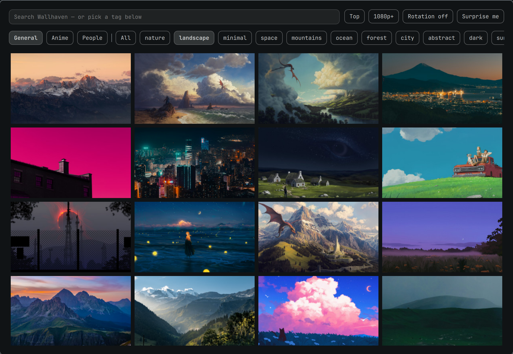

# Wallarchy

Wallhaven wallpapers for [Omarchy](https://omarchy.org). Browse by category or
tag, click a wallpaper to set it as your background, and let it rotate on a
timer.

No account, no API key, no signup — Wallhaven's search API serves SFW results
to anonymous callers.



## Install

```bash
omarchy plugin add https://github.com/perminder-klair/wallarchy.git --enable --yes
```

### Removal

```bash
omarchy plugin remove co.klair.wallarchy --yes
```

That takes the widget out of the bar and deletes the plugin directory. Removal
leaves your files alone by design, so delete anything you no longer want:

```bash
rm -f ~/.config/omarchy/wallarchy.json ~/.config/omarchy/wallarchy.key
rm -rf ~/.local/state/wallarchy
rm -f ~/.config/omarchy/backgrounds/*/wallhaven-*        # downloaded wallpapers
```

If a downloaded wallpaper is the one currently applied, pick another with
`omarchy theme bg next` before deleting it.

## Using it

| Action | Where |
|--------|-------|
| Browse, search, filter | Left click the bar icon |
| Apply a random wallpaper matching the filters | Middle click, or "Surprise me" |
| Toggle rotation on/off | Right click |
| Narrow by category | General / Anime / People toggles |
| Narrow by subject | Tag chips, or type anything into the search box |
| Sort, minimum size, rotation interval | The buttons beside the search box |

Bind the overlay to a key in `~/.config/hypr/bindings.lua`:

```lua
o.bind("SUPER SHIFT", "W", "omarchy-shell shell toggle co.klair.wallarchy '{}'")
```

## How it fits Omarchy

Wallpapers are not rendered by this plugin. Images are downloaded into the
**current theme's** user background folder —
`~/.config/omarchy/backgrounds/<theme>/` — and applied with
`omarchy theme bg set`. That means they join the native per-theme pool, so
`omarchy theme bg next` and the stock background switcher cycle them too.

Only the newest `keepLast` downloads are kept. Pruning only ever touches files
named `wallhaven-*`, so theme wallpapers and anything you added by hand are
left alone. Each download gets a `<file>.source.json` sidecar pointing back at
its Wallhaven page.

## Configuration

One file, `~/.config/omarchy/wallarchy.json`, shared by the bar widget, the
overlay, and the rotation service:

| Key | Meaning |
|-----|---------|
| `query` | Tag or free-text search. Empty means "everything" |
| `categories` | Three-character bitfield: general, anime, people. `100` is general only |
| `purity` | Three-character bitfield: sfw, sketchy, nsfw. `100` is SFW only |
| `sorting` | `toplist`, `date_added`, `views`, or `favorites` |
| `topRange` | Window for `toplist`: `1d`, `3d`, `1w`, `1M`, `3M`, `6M`, `1y` |
| `atleast` | Minimum resolution, e.g. `1920x1080`. Empty means any |
| `ratios` | Aspect ratio filter, e.g. `16x9`. Empty means any |
| `rotateMinutes` | `0` disables rotation; otherwise minutes between changes |
| `downloadDir` | Override the download folder. Empty means the current theme's |
| `keepLast` | How many downloads to keep |

Edit it in the overlay, or from the CLI:

```bash
wallarchy config show
wallarchy config set query mountains
wallarchy config set rotateMinutes 60
wallarchy config set categories 110   # general + anime
```

Everything else the plugin does is available from the same CLI —
`wallarchy help` lists it.

### Sketchy and NSFW results

`purity` is config-only, deliberately — it is not a button you can hit by
accident. `110` adds Wallhaven's "sketchy" tier. The `nsfw` bit additionally
requires an API key from your Wallhaven account settings:

```bash
wallarchy key set <api-key>
```

The key is written to `~/.config/omarchy/wallarchy.key` with mode 0600 and is
handed to curl over stdin, so it never appears in `shell.json` or in `ps`.

## Development

The plugin is three QML surfaces over one bash CLI. All network and JSON work
lives in `wallarchy`; the QML only ever sees the normalized
`{id, thumb, preview, full, color, label, link, ext}` shape it prints, which is
why swapping the image source is a single-file change.

The overlay sets `keepLoaded: true`, so its window survives between summons —
`omarchy-shell shell rescanPlugins` will not pick up edits to `Browser.qml`.
Use `omarchy restart shell` after changing it.

## What it touches

Wallarchy never edits Omarchy's own configuration. It writes only:

| Path | When |
|------|------|
| `~/.config/omarchy/wallarchy.json` | Its own settings, on any filter change |
| `~/.config/omarchy/wallarchy.key` | Only if you set an API key (mode 0600) |
| `~/.local/state/wallarchy/` | Which wallpaper is applied, and rotation timing |
| `~/.config/omarchy/backgrounds/<theme>/wallhaven-*` | Downloaded wallpapers |

Setting a background calls `omarchy theme bg set`, the stock command. Pruning
is limited to files matching `wallhaven-*` in the download folder, and skips
the wallpaper currently in use.

The bar-widget entry in `shell.json` is added and removed by Omarchy's own
`omarchy plugin enable` / `disable`, not by this plugin.

## Requirements

`curl`, `jq`, and `file` — all present on a stock Omarchy install.

### External services

Images and metadata come from [Wallhaven](https://wallhaven.cc) via its public
API at `wallhaven.cc/api/v1`. Requests are anonymous unless you set an API key.
Thumbnails are loaded directly from Wallhaven's CDN; full images are downloaded
only when you apply one. No other network calls are made, and nothing is sent
anywhere about you.

## License

MIT — see [LICENSE](LICENSE).
