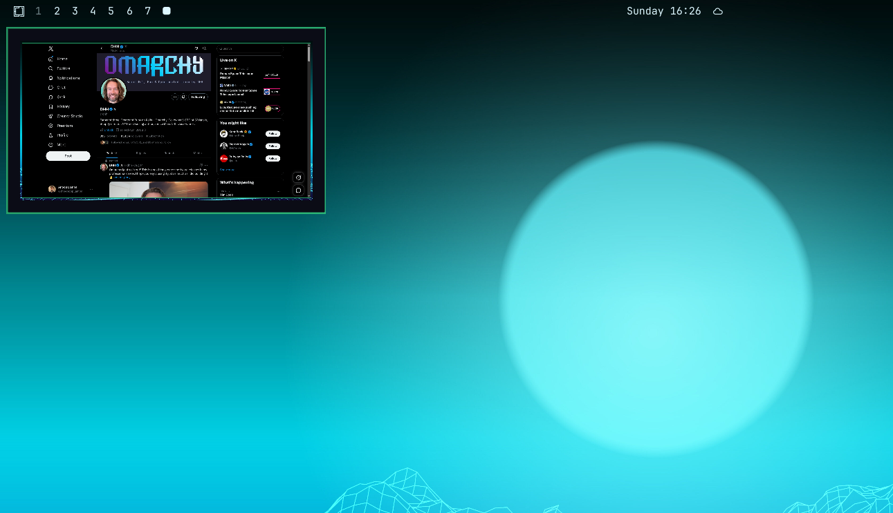

# Workspace Peek

Workspace Peek adds a themed, static preview to Omarchy's workspace indicators. Hover a workspace number to see a snapshot of its windows and wallpaper, while clicking the number or preview still switches immediately to that workspace.



## Features

- 100 ms hover activation and 200 ms close delay
- Static snapshots captured on each hover
- Wallpaper-only previews for empty workspaces
- Direction-aware transitions between workspace previews
- Window icon and title fallbacks for unsupported or unavailable captures
- Preview sizing that preserves the monitor aspect ratio and excludes the top bar
- Multi-monitor-aware window placement
- Screen-sharing privacy protection with a temporary opt-in override
- Omarchy theme-aware styling

## Install

```sh
omarchy plugin add https://github.com/AnoopLamba/omarchy-workspace-preview.git --enable
```

The plugin replaces Omarchy's built-in workspace widget. Restart the shell if the widget does not appear immediately:

```sh
omarchy restart shell
```

## Usage

- Hover a workspace number to open its preview.
- Move between workspace numbers to transition between previews.
- Click a workspace number or click inside the preview to focus that workspace.
- Move the pointer away to close the preview.

## Privacy

Previews are hidden when screen sharing is detected through PipeWire portal markers or `gpu-screen-recorder`. Detection is best effort. When sharing is detected, the preview offers a temporary opt-in override for the current session.

## Requirements

- Omarchy with the Quickshell bar
- Hyprland
- No additional services or packages

## Removal

```sh
omarchy plugin remove io.github.anooplamba.workspace-preview
```

## License

MIT. See [LICENSE](LICENSE).
