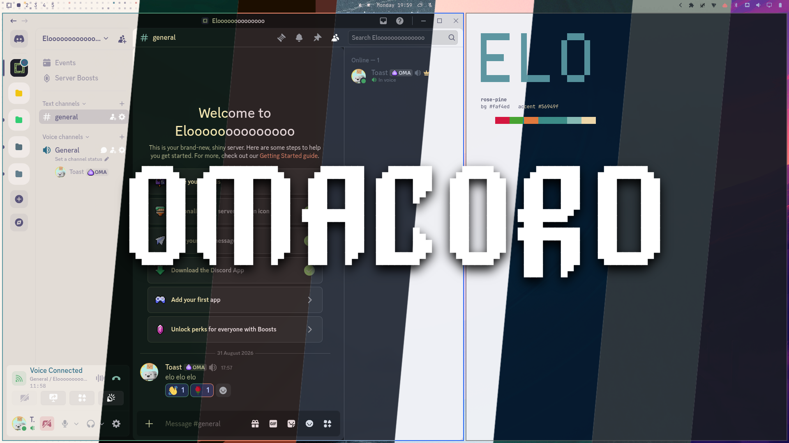

# omacord

**omacord is a Vencord theme that follows your Omarchy desktop theme.**

Run `omarchy theme set tokyo-night` and Discord recolours along with your
terminal, your bar and your editor. The theme is regenerated from the active
Omarchy palette and handed to Vencord, which reloads it on the spot.



It is only CSS. Vencord already supports user themes, so omacord needs no
client patching, no browser extension, no privileged settings and no
background process. If you remove it, Vencord carries on exactly as before.

## Requirements

- Omarchy 4.x
- A Discord client running Vencord (see below)
- `jq`, which ships with Omarchy

## Supported clients

omacord installs into any client that uses Vencord's themes folder. It detects
what you have and installs into each one:

| Client | What it is | Path |
|---|---|---|
| [Vesktop](https://github.com/Vencord/Vesktop) | A standalone Discord desktop app for Linux, with Vencord built in. Nothing extra to install. | `~/.config/vesktop/themes` |
| [Vencord](https://vencord.dev) | Vencord installed into the official Discord desktop app with its own installer. | `~/.config/Vencord/themes` |

Flatpak versions of either are picked up under `~/.var/app/`. Vesktop is the
easiest route on Omarchy, since Vencord comes with it.

Vencord in the browser is not supported: the browser extension loads themes
from a URL rather than from a folder on disk, so there is no local file for
Omarchy to rewrite.

## Install

```bash
omarchy plugin add https://github.com/ASwenia/omacord.git --enable
```

The plugin runs the installer at the next shell start. To do it immediately:

```bash
~/.config/omarchy/plugins/io.github.aswenia.omacord/install.sh
```

Standalone, without the Omarchy plugin system:

```bash
git clone https://github.com/ASwenia/omacord.git
cd omacord && ./check.sh && ./install.sh
```

### Turning it on

The installer switches the theme on in Vencord for you, but only when Discord
is closed. Vencord keeps its settings in memory and writes the whole file back
when it exits, so anything written underneath a running client is thrown away.
The installer detects this and leaves your settings alone rather than losing
them.

So: **close Discord before installing** and there is nothing else to do. If
Discord was open, the installer says so, and you turn omacord on once by hand
in Vencord under `Settings > Themes`. It stays on after that.

## Removal

```bash
~/.config/omarchy/plugins/io.github.aswenia.omacord/uninstall.sh
omarchy plugin remove io.github.aswenia.omacord
```

This deletes the theme file and takes omacord back out of Vencord's enabled
list. As with installing, the enabled list can only be edited while Discord is
closed, so if it is running you are told to untick omacord yourself under
`Settings > Themes`.

Disabling the Omarchy plugin on its own deliberately leaves Discord themed, so
that nothing changes under a running client. Only `uninstall.sh` reverts it.

## Style layers

The palette always applies. On top of it, layers restyle Discord toward the
Omarchy look. Pass a comma-separated list:

| Layer | Effect | Default |
|---|---|---|
| `rounded` | Corner radii matched to Hyprland's `decoration:rounding` | on |
| `flat` | Drop shadows replaced with single-pixel borders | on |
| `compact` | Tighter spacing, closer to a tiling desktop | on |
| `transparent` | Lets the wallpaper through. Needs Vencord's own transparency setting | off |

```bash
OMACORD_LAYERS=all ./install.sh            # everything, transparency included
OMACORD_LAYERS=none ./install.sh           # palette only, no restyling
OMACORD_LAYERS=rounded,flat ./install.sh   # pick your own
```

`OMACORD_LAYERS=none` is the escape hatch if a Discord update ever breaks a
structural rule. You keep the colours and drop the layout changes without
waiting for a release.

## How it works

1. `assets/omarchy/omacord.palette.css.tpl` is installed into
   `~/.config/omarchy/themed/`. Omarchy's template engine renders it into
   `~/.local/state/omarchy/current/theme/omacord.palette.css` on every theme
   change, substituting the active `colors.toml`.
2. A script in Omarchy's own `~/.config/omarchy/hooks/theme-set.d/` joins that
   palette to the stylesheet and **writes** the result into the themes folder
   of every Vencord client it finds.
3. Vencord watches that folder and reloads the theme, with no restart.

Step 2 is where the work happens. Linking the generated file is the obvious
approach and it reads fine, but it never reloads: Vencord's watch fires when
an entry in the folder changes, not when the target of a link changes. Writing
the file is what makes the recolour land immediately. The write is staged
inside the destination folder and renamed into place, so Vencord never reads a
half-written stylesheet, and it is skipped entirely when nothing has changed.

The theme maps the Omarchy palette onto Discord's own CSS variables, covering
both the older token names and the current visual refresh set. Tokens that
Discord defines with transparency, such as the hover and scrim layers, stay
transparent.

### Themes can override it

If your Omarchy theme ships its own `vencord.theme.css`, that file is used
verbatim instead of the generated palette. A theme author's hand-tuned Discord
styling should beat anything derived automatically.

## What it touches

Everything below is backed up to `~/.local/state/omacord/backups/<timestamp>/`
before it is modified:

| Path | Why |
|---|---|
| `~/.config/omarchy/themed/omacord.palette.css.tpl` | the palette template |
| `~/.config/omarchy/hooks/theme-set.d/omacord` | the script Omarchy runs on a theme change |
| `~/.local/share/omacord/` | the flattened stylesheet and shared helpers |
| `<client>/themes/omacord.theme.css` | the generated Vencord theme |
| `<client>/settings/settings.json` | appends `omacord.theme.css` to Vencord's `enabledThemes` |

The settings edit only ever appends, so themes you already enabled in Vencord
stay enabled, and it is skipped entirely while Discord is running.

## Credits

The rendered-template and hook mechanism omacord is built on is Omarchy's own:
`~/.config/omarchy/themed/` and `~/.config/omarchy/hooks/theme-set.d/` are
standard parts of Omarchy, and it ships templates of its own for Obsidian,
VS Code, btop and others.

[omarchy-zen](https://github.com/Davidxap/omarchy-zen) by David Arturo Arroyave
Pérez is prior art for wiring a themed application into that mechanism through
a shell plugin, and is worth reading if you want the browser equivalent.
omacord delivers the stylesheet differently, for the reason described above.

The list of Discord variables worth overriding was worked out from the
`vencord.theme.css` that ships with the **everpuccin** Omarchy theme by
`@bypass_`, which is the most thorough mapping of that surface I found.

## License

MIT, see [LICENSE](LICENSE).
