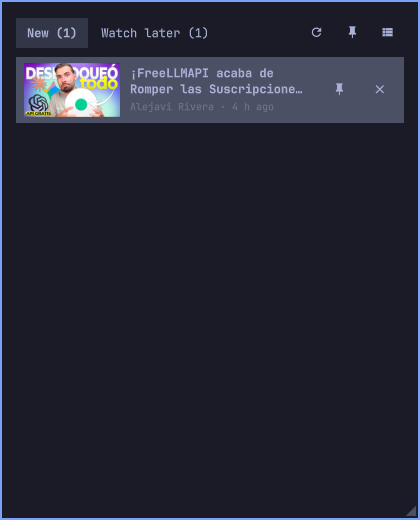

# Fresh Tube

The latest unseen video of the YouTube channels you pick, one click from the
Omarchy bar, played in mpv.

You follow dozens of channels but only a handful matter every day, and finding
them on youtube.com means scrolling past everything else. Fresh Tube keeps
your own short list: the bar shows how many of those channels posted something
you have not watched, the panel lists one video per channel, a click plays it
in `mpv`, and what you watched disappears.



What it does:

- Shows in the bar how many of your channels have a video you have not seen.
- Lists one video per channel, newest first, with its thumbnail; a click plays
  it in mpv as a small floating window below the bar, and the video leaves
  the list.
- Keeps a `Watch later` list of your own: paste any video link, reorder by
  dragging, and a video leaves the list when mpv reaches its end.
- Pins up to three videos that should stay listed after you play them.
- Falls back to Chromium in app mode (just the player, signed in with your
  own account) when YouTube blocks mpv's downloader.
- Reads each channel's public RSS feed: no API key, no login, nothing synced
  with your YouTube account.

## Install

```sh
omarchy plugin add https://github.com/FerC10110/omarchy-fresh-tube.git --enable
```

The bar gains a 󰗃 button on the left. It needs `python3`, `mpv` (with
`yt-dlp`, which mpv uses for YouTube) and, only as a fallback when a channel
page gives nothing away, `yt-dlp` on `PATH`; all ship with Omarchy. The
browser fallback runs `chromium`; Settings below picks another browser or
turns it off.

## Use

- Click the icon to open the panel; the number next to it is how many new
  videos there are.
- Click 󰕲 and paste a channel: `https://www.youtube.com/@handle`, a
  `/channel/UC…` link, a bare `@handle`, or even a video link (its channel is
  added). Remove a channel with ✕.
- Click a video to play it, normally in mpv. Hover a row and click ✕ to mark
  it seen without playing.
- 󰐃 in the header pins the panel: it stays open while you click elsewhere or
  open other bar panels. Drag the ◢ corner to resize. Both are remembered.
- 󰐃 on a row pins that video (up to three): it moves to the top and stays
  listed after you play it, for the album you play all week or the long talk
  you watch over several days. Unpin it when you are done.
- The `Watch later` tab is your own list: paste a video link (watch, youtu.be,
  shorts, embed or live) and it lands at the bottom with its title, channel
  and thumbnail. Drag a row up or down to reorder (press on its thumbnail or
  title and move), or press `Ctrl+↑` / `Ctrl+↓`. A video leaves the list
  when mpv reaches its end; close mpv early and it stays, resuming where you
  left off next time. `✕` or `Delete` marks it seen and removes it.
  `Ctrl+Tab` switches tabs.
- Playing opens mpv as a small floating window below the bar, left-aligned, a
  quarter of the screen wide. Move or resize it as you like: the size is
  remembered for next time, the position resets. This needs Hyprland
  (`hyprctl`); elsewhere mpv opens wherever it likes.
- When mpv cannot open a video at all (YouTube sometimes blocks yt-dlp with a
  "sign in to confirm you're not a bot" check), the video opens in Chromium
  instead: app mode, no address bar, just YouTube's player, in a profile of
  its own, placed and sized like the mpv window. The page that embeds the
  player is served by the plugin on a local port only while that window is
  open (YouTube's player refuses to play without a referring page). Run
  `fresh-tube login` once to sign in to YouTube in that profile (and, if you
  like, add an ad blocker there); with another browser as `fallbackCommand`,
  run `fresh-tube login --player <that command>`. In the browser the video
  starts from the beginning and does not leave Watch later by itself: use ✕
  or `Delete`. To try the browser without waiting for mpv to fail, run
  `fresh-tube play --player chromium <videoId>`.
- Middle-click the icon to refresh without opening.
- Keyboard: ↑/↓ select, Enter plays, Delete dismisses (not a pinned video),
  P pins or unpins, Ctrl+R refreshes, Esc closes.

Feeds refresh every 15 minutes, when the panel opens, and on demand.

Videos come from each channel's RSS feed. When YouTube's feed answers with an
error (it goes down now and then), the plugin asks `yt-dlp` for the channel's
newest uploads instead and the channels view says "via yt-dlp". A channel is
kept even when neither source answers; it gets its name and videos on the next
refresh that works.

## Settings

Inline on the widget entry in `~/.config/omarchy/shell.json`:

| Key | Default | What it does |
|---|---|---|
| `playerCommand` | `mpv` | Command that gets the video URL as its last argument. |
| `fallbackCommand` | `chromium` | Browser opened when mpv cannot open a video; empty disables it. |
| `refreshMinutes` | `15` | Minutes between automatic refreshes. |

```sh
omarchy bar set io.github.ferc10110.fresh-tube playerCommand "mpv --profile=yt"
```

With a player other than `mpv`, videos still play but the end of a video is
not detected and the window size is not remembered.

## Keybinding

```lua
o.bind("SUPER + SHIFT + Y", "Fresh Tube", "omarchy-shell io.github.ferc10110.fresh-tube toggle")
```

## Files

- `~/.config/fresh-tube/channels.json`: your channels.
- `~/.local/state/fresh-tube/state.json`: seen videos, cached feeds, pinned
  videos, the Watch later list, popup and player sizes.
- `XDG_CONFIG_HOME` and `XDG_STATE_HOME` override those locations.

Everything comes from each channel's public RSS feed
(`youtube.com/feeds/videos.xml?channel_id=…`): no API key, no login, and no
sync with your YouTube account.

Every answer read from the network has a hard size cap, set in
`lib/fresh_tube/limits.py`: 1 MiB for a feed, 8 MiB for a channel or video
page, 64 KiB for oEmbed, and 1 MiB for each of yt-dlp's outputs. A bigger
answer counts as a failed fetch and is never parsed, so a broken server
cannot make the plugin eat memory.

## Remove

```sh
omarchy plugin remove io.github.ferc10110.fresh-tube
```

Your channels and state stay on disk: delete `~/.config/fresh-tube/` and
`~/.local/state/fresh-tube/` (the browser profile lives there too) to wipe
them.

## Development

```sh
PYTHONDONTWRITEBYTECODE=1 python3 -m unittest discover -s tests -v
node --test tests/model.test.js
```

The Python tests use a temporary home and never touch the network. Saving any
file in the plugin folder reloads it in the running shell; errors show in
`quickshell log -p /usr/share/omarchy/shell -t 40`.

The `bin/fresh-tube` script is usable on its own: `add`, `remove`, `channels`,
`refresh [--cached]`, `seen`, `pin`, `unpin`, `queue add|move`, `done`, `play`,
`login`, `prefs get|set`. `channels`, `refresh` and `queue` take `--json` for
machine output. `mpv/fresh-tube.lua` is the mpv script `play` loads; it calls
`done` and `prefs set` back.

## License

MIT, see `LICENSE`. `THIRD_PARTY_NOTICES.md` credits the two MIT-licensed
files `FeedPopup.qml` adapts.
