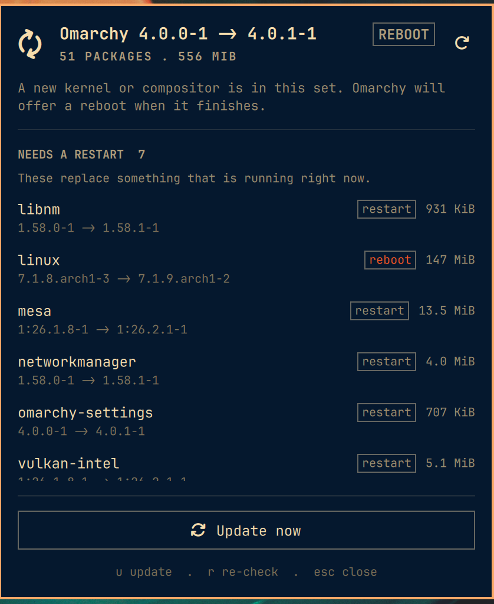

# Omarchy Update Review

An Omarchy bar widget that shows you exactly what an update would change,
before you start it.



## The problem

Omarchy's built-in update icon appears when the `omarchy` package is behind,
and clicking it runs `omarchy-update` immediately.

But `omarchy-update` upgrades your whole system. On a typical Arch box that is
fifty or more packages, often including a kernel. So the icon reports one
package while the click changes every package, and there is nowhere to look in
between.

This widget puts the looking in between.

## What it does

Left click opens a panel listing every pending change:

- **Omarchy's own version move**, in the header, because that is why the icon
  lit up in the first place
- **Every pending package** with its version move and download size
- **A `reboot` or `restart` tag** on anything that replaces something currently
  running, sorted to the top under `NEEDS A RESTART`
- **Total package count and total download**
- **AUR packages**, when any foreign packages are installed

The two tags are not invented. They mirror what Omarchy's own
`omarchy-update-restart` prompts for once the update finishes, so the panel
promises exactly what the update will ask of you afterwards.

Right click still runs `omarchy-update` straight away, exactly as the stock
icon did, so nothing you already have in your fingers stops working.

## What it does not do

- It never updates anything on its own.
- It never nags. The icon still appears **only** when Omarchy itself is behind,
  not whenever any package is pending. On Arch that would be most days, and an
  icon that is always lit is an icon you stop reading.
- It never writes to your system. See [Safety](#safety).

## Install

```bash
omarchy plugin add https://github.com/jampick/omarchy-update-review.git --enable
```

The manifest declares `clonedFrom: omarchy.system-update`, so the shell swaps
this in for the built-in icon rather than giving you two of them.

Remove it and get the built-in back:

```bash
omarchy plugin remove jampick.system-update
```

That backs up the folder first.

## Keys

| Key | Does |
|-----|------|
| Left click | Open the panel |
| Right click | Run `omarchy-update` straight away |
| `u` | Update, from inside the panel |
| `r` | Re-check the mirrors |
| Up / Down | Scroll the change list |
| `Esc` | Close |

## Safety

`bin/omarchy-update-scan` and `bin/omarchy-update-check` are the only things
that touch the system, and both are read-only.

**It never takes the pacman lock.** `checkupdates` syncs a throwaway database,
never the real one, so the scan is safe to run while a real pacman is busy and
cannot leave the system half-synced. Download sizes come from that same
temporary database, because your real one has not been synced and still
describes the versions already installed.

**Everything runs inside a boundary, not just next to one.**
`bin/omarchy-update-bounded` starts each producer as a process group of its
own and gives it a deadline and a byte cap. This matters because QML can only
stop the process it started, while both producers are trees: `timeout`,
`checkupdates`, `fakeroot`, `pacman`, `git`, `jq`, `awk` and pipelines between
them. Stopping the one child the shell has a handle on can leave the rest of
that tree running after the panel has said it is done. Cancelling here signals
the whole group and does not return until the group is gone, escalating from
TERM to KILL if it has to. The deadline is held by a watchdog outside the group
it guards, so the group stays bounded even if the launcher itself is killed.

**The availability check is bounded too.** The icon is driven by
`bin/omarchy-update-check`, not by `omarchy-update-available` directly, so the
question that runs every few hours gets the same process group, deadline and
cap as the detailed scan. It is also the run that syncs the temporary database,
which is what keeps opening the panel off the network.

**Its output is capped.** Everything the scan prints is collected by a QML
`StdioCollector` inside the long-running shell process, and `StdioCollector`
has no size limit of its own: it buffers a process to completion and then hands
QML the lot, and a limit applied after that has already happened is not a
limit. So both producers are capped in a separate process before the shell sees
a byte: 512 KiB for the scan, 4 KiB for the availability check. The producer is
closed down at the moment it exceeds the cap rather than merely ignored
afterwards. Real output is about 12 KiB for fifty pending
packages. Hitting the cap is reported as a readable error rather than as
truncated JSON, because half a JSON document parses as nothing useful and would
look like a bug in the panel.

**Its rows are capped too, and it says so when they are.** Every row the scan
prints becomes a `Repeater` delegate inside the shell, and the shell outlives
the panel, so cardinality is bounded before the JSON is printed: 250 packages,
100 AUR packages, 50 dev commits. Rows that change something currently running
are ordered first, so a cap can only ever drop packages that land quietly on
disk, never the kernel that makes the panel say REBOOT. The document carries
`counts` and `omitted` alongside the trimmed lists, so the header still counts
the whole update and the panel says out loud how many rows it is not showing.

**Nothing renders as anything but text.** Package names, repositories and
versions are the package's to choose. Every `Text` in the panel is
`Text.PlainText`, and the two strings handed to shared components whose
`textFormat` this plugin does not own (the panel header and the bar tooltip)
are flattened in `Model.js` first. `Model.parseReport` is the single intake:
it re-caps rows and string lengths, drops every field the panel does not draw,
and reduces a tag to one of the exact two the panel knows how to render. The
scan already does all of this, but the shell has to survive a document it did
not produce.

**Nothing but a deliberate gesture starts an update.** There are three ways in
and no others: right click the bar icon, click **Update now**, or press `u`
with the panel open. Enter and Space do not activate anything. In a panel whose
one action upgrades the whole system, a key you press to scroll or to answer
something else should never be the key that starts it.

**Its temporary database is private, and verified rather than assumed.**
`checkupdates` would sync into `${TMPDIR:-/tmp}/checkup-db-$UID`: a predictable
name in a directory the whole machine can write to. Nothing read from it can
change what an update installs, because `omarchy-update` goes through the real
pacman database and never this one, but it does decide which versions and sizes
you are shown before you agree to an update, and a decision input should not be
a name another process can reach first. So this plugin uses its own database
under `$XDG_RUNTIME_DIR`, which your login session creates `0700` and owns, and
checks every component of it with `lstat` for being a real directory, owned by
you, with no group or other bits: a symlink is rejected outright. A component
that fails the check is refused, never repaired, because repairing a path
somebody else prepared is how you end up owning their symlink. If the runtime
directory is unavailable it falls back to a freshly created private directory
per run, which is correct but has no previous sync to reuse. See
`bin/omarchy-update-db.sh`.

**Every external call has a deadline.** `checkupdates`, the AUR helper, `git
fetch` and `pacman -Si` each run under `timeout`, inside the process group
above, under the overall scan deadline. A package the `pacman -Si` stage misses
keeps its name and both versions and loses only its size, which is decoration
next to the decision the panel exists to support.

**It always answers.** Offline, missing `checkupdates`, a stalled mirror: every
failure comes back as valid JSON carrying a sentence the panel shows you, never
a stack trace and never an empty list pretending nothing is pending.

Run it yourself to see everything the panel sees:

```bash
~/.config/omarchy/plugins/jampick.system-update/bin/omarchy-update-scan | jq
```

## When it checks

| Trigger | Cost |
|---------|------|
| Every `checkIntervalHours` (default 6) | One availability check |
| Right after that check finds Omarchy behind | Free: reuses the database the check just synced |
| Panel open, if the cache is older than `staleAfterMinutes` (default 10) | One sync, about 3 seconds |
| The refresh button, or `r` | One sync |

Opening the panel shows the cached list immediately and refreshes behind it, so
it is never a blank wait.

## Settings

On the widget's layout entry in `~/.config/omarchy/shell.json`:

```json
{ "id": "jampick.system-update", "checkIntervalHours": 6, "staleAfterMinutes": 10 }
```

## Requirements

`pacman-contrib` (for `checkupdates`) and `jq`. Both ship with Omarchy. Without
`checkupdates` the panel says so rather than showing an empty list.

## Tests

```bash
./test/scan.test.sh
```

Read-only against the real system, and it runs `test/model.test.js` too, so one
command covers the scan and the intake that re-caps what it produces. Asserts
the JSON contract the panel depends on, proves both byte caps fire and degrade
to a readable error, and proves the row cap fires against a stub `checkupdates`
without dropping a tagged row or undercounting the update.

It also exercises the runtime boundary directly, because none of it shows up in
the output and it would rot without something holding it: that cancelling the
launcher takes a three-deep process tree with it and does not return early,
that the deadline and the byte cap fire and report themselves distinctly, that
a producer's exit status survives, that the database resolver refuses a
symlinked runtime directory and a world-writable one without tightening
either, and that a scan never touches the shared predictable path.

## Layout

```
manifest.json            plugin manifest and settings schema
SystemUpdate.qml         bar button and panel
Service.qml              the two questions asked of the system, and caching
Model.js                 intake, formatting and grouping
bin/omarchy-update-scan  read-only scan, emits JSON
bin/omarchy-update-check bounded availability check, drives the icon
bin/omarchy-update-bounded  process group, deadline and byte cap for both
bin/omarchy-update-db.sh verified private pacman database, shared by both
test/scan.test.sh        contract and cap tests, runs the suite below too
test/model.test.js       intake, caps and formatting
```

## Notes for hacking on it

Two things cost real time and are not discoverable from the logs:

- `data` is a read-only property on every QML `Item`. Declaring
  `property var data` on a plugin component fails at load with
  `Invalid property assignment: "data" is a read-only property`, reported at
  the line where the component is *instantiated*, not where it is declared.
- The shell replays a plugin's last load error on every hot reload. After
  fixing a load failure, run `omarchy restart shell`. A `rescanPlugins` or a
  file touch keeps printing the old error at the old line number, which reads
  exactly like a correct fix not working.

Read the shell log with:

```bash
qs log -i "$(qs list -a | grep -oP 'Instance \K\w+' | head -1)"
```

## Credit

Built on Omarchy's own shell kit (`Panel`, `PanelHero`, `PanelSectionHeader`,
`CursorSurface`, `Button`), modelled on the first-party Network and Bluetooth
panels, so it themes and keyboard-navigates like everything else in the bar.

MIT.
