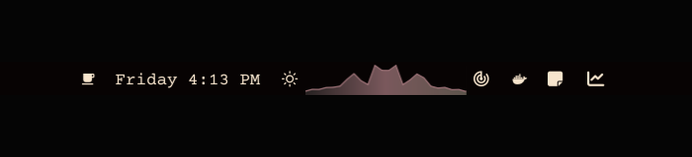

# Omarchy Beatbar

Beatbar is a live, theme-reactive frequency visualizer for the Omarchy 4.x
Quickshell bar. It listens to the monitor of the current default PipeWire sink,
so every application routed to that output contributes to the visualization.
It does not record, save, or transmit audio.

The plugin runs one CAVA analyzer for the graphical session and shares its
24-band spectrum with every monitor's bar widget. **Garden** grows frequency
reeds from the bar edge, **Mirror** expands around a centerline, and **Aurora**
draws a filled spectral ribbon with a left-to-right, bass-driven light wave.
Low-frequency transients add a short configurable spring kick. All colors bind
to Omarchy's live bar palette and change with the active theme.



## Install

Beatbar requires the `cava` executable to already be available on `PATH`.
Install that dependency separately using your normal trusted system software
workflow, then confirm it is present:

```bash
command -v cava
```

If CAVA is unavailable, Beatbar remains idle and shows one Omarchy OSD directing
the user to this README. The check does not fetch software, invoke a package
tool, or alter the system. Beatbar also uses `setpriv` from Omarchy's base
`util-linux` package only to stop CAVA when the shell exits.

Add Beatbar from its public repository:

```bash
omarchy plugin add https://github.com/ryrobes/omarchy-beatbar.git --enable
```

Beatbar declares the center as its default bar section. Omarchy asks you to
confirm placement when enabling it. Beatbar itself never invokes a package
manager, installs dependencies, or requests elevated access.

## Interact

- Left click cycles **Garden -> Mirror -> Aurora**.
- Mouse wheel changes visual gain from 40% to 250%.
- Widget settings control mode, width, gain, bass motion, the Aurora sweep, and
  the silent baseline.

Inspect or restart the analyzer service:

```bash
omarchy-shell ryrobes.beatbar status | jq
omarchy-shell ryrobes.beatbar restart
```

## Update or remove

```bash
omarchy plugin update ryrobes.beatbar
omarchy plugin remove ryrobes.beatbar
```

`cava` is shared system software and is deliberately not removed with the
plugin. Manage that separate prerequisite through your normal system software
workflow.

## Audio and permissions

- External dependency: the Arch package `cava`.
- Platform utility: `setpriv`, supplied by Omarchy's base `util-linux` package.
- Audio access: CAVA reads `source = auto`, the monitor of the current default
  PipeWire output. This normally includes browsers, players, games, calls, and
  `omarchy-motion`; it intentionally excludes microphone input.
- Runtime process: Beatbar starts `setpriv --pdeathsig TERM cava -p
  <plugin>/cava.conf` as the current desktop user. The process ends with the
  Omarchy shell.
- Privileges: Beatbar runs entirely as the current desktop user. It does not
  request administrator or root access.
- Network and storage: no network requests, audio files, recordings, databases,
  or background system services.

Like all Omarchy shell plugins, Beatbar runs unsandboxed inside the shell. Read
[SECURITY.md](SECURITY.md) for the complete trust boundary and data flow.

## Local development

The repository intentionally contains no installer or setup helper. The
community installation path is Omarchy's own plugin manager. Validate a source
checkout with:

```bash
./tests/test.sh
qmllint -I /usr/share/omarchy/shell BarWidget.qml
```

The system Qt 6.8 `qmllint` does not understand Quickshell IPC functions with
typed return values, so `Service.qml` is covered by Omarchy plugin validation,
the structural tests, and the live `status` IPC check.

## License

[MIT](LICENSE)
